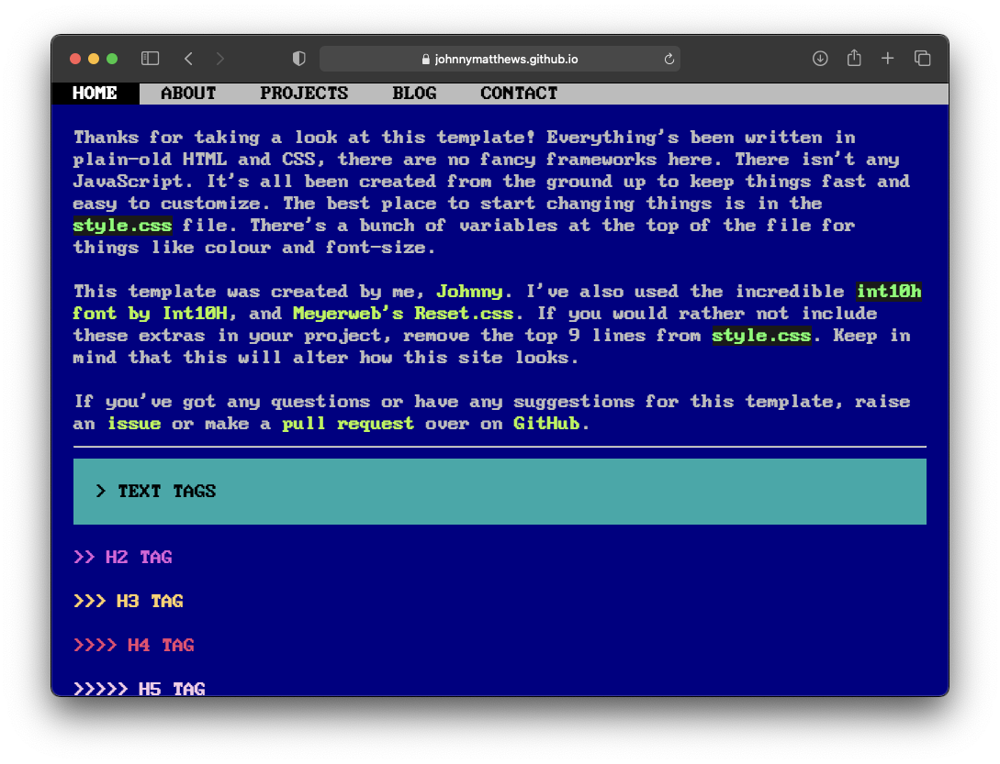

# Blue terminal website

A super simple website theme, built from vanilla CSS. There's no fancy frameworks or dependencies to install. Just clone the site and go.

There's a demo you can [view here](https://johnnymatthews.github.io/blue-terminal-website/)

---

This project is for use under the [MIT License](https://mit-license.org/). The `dos.tff` font was created by [Zeh Fernando](http://zehfernando.com/).
