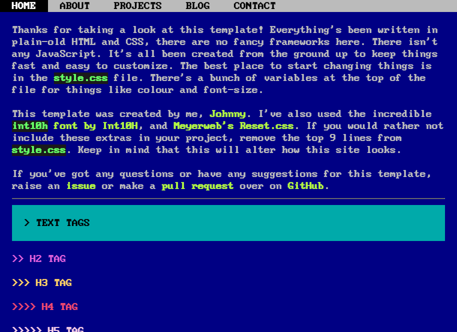

# Terminal Blog

This is the public repository for the terminal-style design of [mohnjatthews.com](//www.mohnjatthews.com). Feel free to clone and play around with this repo as much as you want. It's shockingly simple and mostly fits on one page.

There's a demo you can [view here](http://www.mohnjatthews.com)

---

This project is for use under the [MIT License](https://mit-license.org/). The `dos.tff` font was created by [Zeh Fernando](http://zehfernando.com/).
